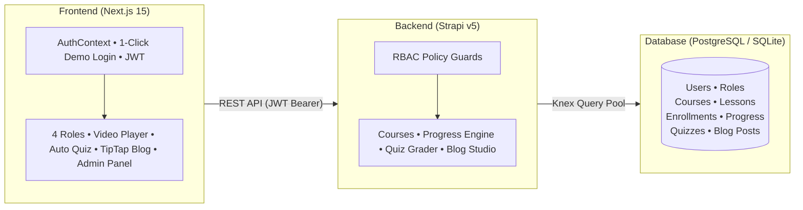

# PathShala LMS — Enterprise Full-Stack Learning Management System

[](https://nextjs.org/)
[](https://strapi.io/)
[](https://swagger.io/)
[](https://www.postgresql.org/)
[](https://railway.app)


## Live Production Deployments

| Component | Platform | Live URL | Description |
|---|---|---|---|
| **Web Application** | Vercel | [https://pathshala-lms.vercel.app](https://pathshala-lms.vercel.app) | Next.js App Router Frontend |
| **Backend REST API** | Railway | [https://pathshala-lms-production.up.railway.app](https://pathshala-lms-production.up.railway.app) | Strapi Headless API Gateway |
| **Interactive API Docs** | Swagger | [https://pathshala-lms-production.up.railway.app/documentation/v1.0.0](https://pathshala-lms-production.up.railway.app/documentation/v1.0.0) | OpenAPI Interactive Swagger UI |
| **CMS Admin Console** | Railway | [https://pathshala-lms-production.up.railway.app/admin](https://pathshala-lms-production.up.railway.app/admin) | Strapi Database & Content Studio |
| **Video Walkthrough** | Google Drive | [Watch Video Walkthrough](#) | Comprehensive technical walkthrough |

---

## System Architecture & Data Flow



---

## Repository Structure (Monorepo)

```
pathshala-lms/
├── backend/                         # Strapi v5 Headless CMS (TypeScript)
│   ├── config/                      # Server, database, plugins & CORS configs
│   ├── src/
│   │   ├── api/                     # Domain modules: course, lesson, progress, quiz, blog-post, admin-dashboard
│   │   ├── extensions/              # OpenAPI 3.0 / Swagger documentation plugin extension
│   │   ├── policies/                # RBAC route guard policies (is-admin, is-instructor, etc.)
│   │   └── index.ts                 # Database bootstrap & automatic demo data seeder
│   ├── package.json
│   └── tsconfig.json
├── frontend/                        # Next.js 15 App Router Frontend
│   ├── public/                      # Static assets (logo.svg, logo-icon.svg)
│   ├── src/
│   │   ├── app/                     # App Router pages: /, /courses, /my-courses, /admin, /blog, /login, /quizzes
│   │   ├── components/              # UI Components: Topbar, AppShell, VideoPlayer, QuizModal, TipTap Editor, Modals
│   │   ├── context/                 # AuthContext (4-Role state & 1-Click demo switcher)
│   │   ├── lib/                     # Type-safe API client (apiFetch)
│   │   └── types/                   # TypeScript interfaces (auth, content, courses, progress)
│   ├── package.json
│   └── tsconfig.json
├── .gitignore                       # Git ignore rules for env secrets, builds, and logs
└── README.md                        # Master project documentation
```

---

## All Implemented Features

### 1. Authentication & Role-Based Access Control
- **Strict 4-Role Permission System:** Distinct roles and capabilities for **Admin**, **Content Manager**, **Instructor**, and **Student** enforced on both frontend and backend.
- **JWT Session Security:** Secure HS256 token authentication with automatic session persistence across browser refreshes using `localStorage` and `cookies`.
- **Smart Role Redirects:** Automatically directs users to their dedicated dashboard on login (`/dashboard` for Admin, `/instructor/courses` for Instructor, `/courses` for Content Manager, `/my-courses` for Student).
- **Protected Route Middleware:** Prevents unauthorized role access with automatic fallback navigation.

### 2. Course Catalog & Curriculum Management
- **Course Studio:** Create, edit, and delete courses with title, category tags, custom gradient cover colors, and Unsplash cover images.
- **Role-Scoped Management:** Instructors manage their own courses and view enrolled student rosters; Content Managers and Admins can manage all courses platform-wide.
- **Lesson Management:** Add sequential video lessons with streaming URLs and lecture notes.
- **Co-Instructor Collaboration:** Assign multiple instructors to co-teach courses.
- **Search & Category Filters:** Quickly find courses by keyword or category.

### 3. Student Learning Portal & Video Player
- **1-Click Enrollment:** Students can browse the catalog and enroll in any course instantly.
- **My Courses Dashboard (`/my-courses`):** Dedicated student portal displaying enrolled courses, dynamic progress bars, and quick resume links.
- **Sequential Lesson Drawer:** Embedded video player with an interactive sidebar showing lesson order and completion checkmarks (`✓`).
- **Real-Time Progress Tracking:** Click "Mark as Completed" to instantly calculate progress (e.g. 2 of 3 lessons = 67%) and save it to the database.
- **Completion Celebration:** Animation on 100% course completion with smart return buttons to the student dashboard.

### 4. MCQ Quizzes & Server-Side Auto-Grading
- **Anti-Cheat Key Protection:** Correct answers and explanations are kept securely on the server and never sent to the browser during the quiz.
- **Instant Server Auto-Grading:** Automatically grades student submissions, calculates percentage scores, checks pass/fail status, and records attempts.
- **Score Badges & Quiz Retake:** Displays previous scores (e.g. "Score: 85% • Passed ✓") on course and lesson pages with an instant "Retake Quiz" button.
- **Instructor Preview Mode:** Instructors and Content Managers can test their quizzes safely in preview mode without saving fake student grades.

### 5. Admin Dashboard & User Management
- **Live Platform** Real-time summary cards tracking Total Registered Users, Active Courses, Total Enrollments, and Published Lessons.
- **Self-Demotion Lockout Guard:** Prevents admins from accidentally removing their own admin access.
- **Course & User Administration:** Search, filter, and delete users directly from the admin panel.

### 6. Blog Portal with Visual Rich-Text Editor & Draft Security
- **Interactive Visual Editor:** Authors write articles with real-time formatting for Headings (H1, H2, H3), Bold, Italic, Code Blocks, Blockquotes, and Lists.
- **Database Draft Isolation:** Draft articles are filtered out at the SQL level (`WHERE is_published = TRUE`) and remain hidden from students and visitors.
- **Direct Link Protection:** Navigating directly to an unpublished draft URL returns `404 Not Found` for non-authors.
- **Cover Images & Author Details:** Includes cover images, publication dates, and author profile badges.

### 7. Developer Experience & API Tools
- **Interactive API Documentation (Swagger UI):** Explore and test all backend endpoints interactively in your browser at `/documentation/v1.0.0`.
- **Automatic Database Seeding:** Automatically migrates and pre-populates all demo accounts, courses, lessons, progress, and quizzes on first launch.
- **Mobile-Responsive Design:** Fully responsive layout with a collapsible mobile hamburger drawer and touch-friendly controls.

## Running Locally

### Prerequisites
- **Node.js:** `v20.x` or `v22.x` LTS
- **npm:** `v10+`

### 1. Clone the Monorepo
```bash
git clone https://github.com/ahad-cse/pathshala-lms.git
cd pathshala-lms
```

### 2. Setup & Run Backend (Strapi v5)
```bash
cd backend
npm install
# Copy environment template (SQLite is used automatically for local development)
cp .env.example .env
npm run develop
```
- **Backend API:** `http://localhost:1337`
- **Swagger Documentation:** `http://localhost:1337/documentation/v1.0.0`
- **Admin Panel:** `http://localhost:1337/admin`
- *On first launch, Strapi automatically runs database migrations and seeds all demo accounts, courses, lessons, progress, and quizzes.*

### 3. Setup & Run Frontend (Next.js 15)
In a separate terminal:
```bash
cd frontend
npm install
# Create local environment config
cp .env.example .env.local
npm run dev
```
- **Web App:** Open [http://localhost:3000](http://localhost:3000) in your browser.

---
