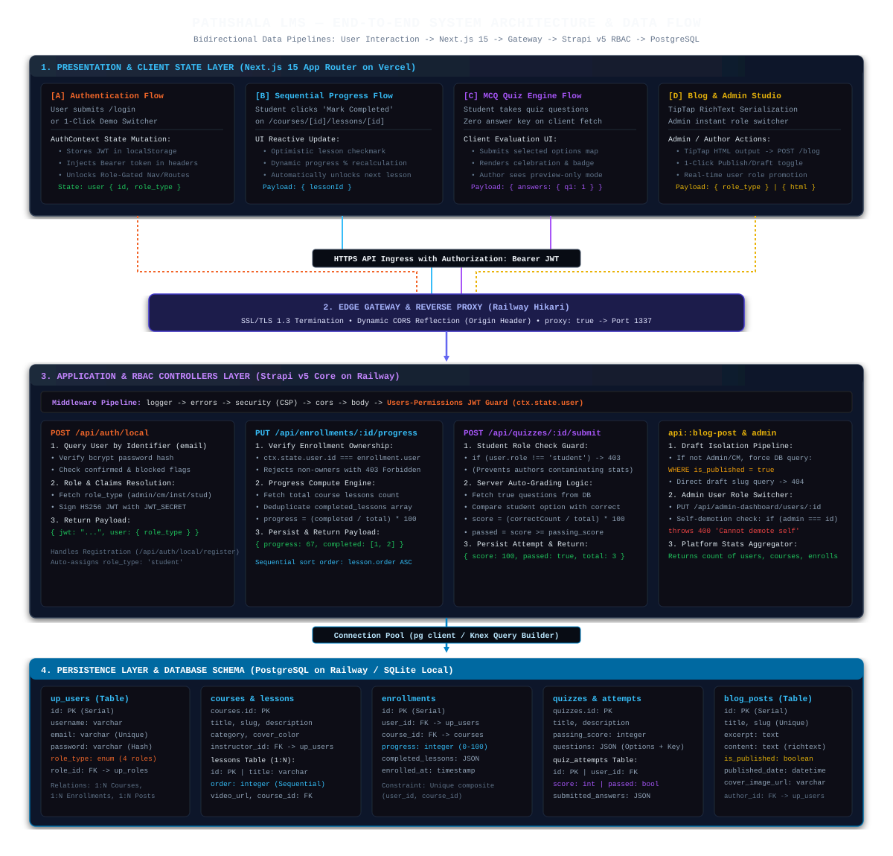

# PathShala LMS — Enterprise Full-Stack Learning Management System

[](https://nextjs.org/)
[](https://www.typescriptlang.org/)
[](https://strapi.io/)
[](https://swagger.io/)
[](https://www.postgresql.org/)
[](https://railway.app)

> **CPS Academy Junior Software Engineer Assessment Project**  
> An enterprise-grade, role-based Learning Management System designed with a decoupled architecture featuring **Next.js 15 (App Router, TypeScript)** on the frontend and **Strapi v5 (Headless CMS, PostgreSQL)** on the backend.

---

## Live Production Deployments

| Component | Platform | Live URL | Description |
|---|---|---|---|
| **Web Application** | Vercel | [https://pathshala-lms.vercel.app](https://pathshala-lms.vercel.app) | Next.js 15 App Router Frontend |
| **Backend REST API** | Railway | [https://pathshala-lms-production.up.railway.app](https://pathshala-lms-production.up.railway.app) | Strapi v5 Headless API Gateway |
| **Interactive API Docs** | Swagger | [https://pathshala-lms-production.up.railway.app/documentation/v1.0.0](https://pathshala-lms-production.up.railway.app/documentation/v1.0.0) | OpenAPI 3.0 Interactive Swagger UI |
| **CMS Admin Console** | Railway | [https://pathshala-lms-production.up.railway.app/admin](https://pathshala-lms-production.up.railway.app/admin) | Strapi Database & Content Studio |
| **Video Walkthrough** | Drive / Loom | [Watch Video Walkthrough](#) | Comprehensive technical walkthrough |

---

## System Architecture & Data Flow



---

## Core Data Flow Pipelines

### 1. Authentication & Role-Based Session Pipeline

`User Login / 1-Click Demo` -> `AuthContext` -> `POST /api/auth/local` -> `Railway Proxy` -> `Strapi Auth Controller` -> `PostgreSQL up_users` -> `JWT Response` -> `Client Route Guards Unlock`

1. **User Action:** The user enters credentials on `/login` or clicks any 1-Click Demo Account button.
2. **Client Transport:** `AuthContext` calls `authApi.login({ identifier, password })` sending a `POST /api/auth/local` request.
3. **Ingress & TLS:** Railway Edge Proxy terminates HTTPS, validates CORS origin against `*.vercel.app`, and forwards to port `1337`.
4. **Backend Processing:**
   - Strapi verifies the password against the bcrypt hash stored in the `up_users` database table.
   - Retrieves the user's explicit role (`admin`, `content_manager`, `instructor`, or `student`).
   - Signs a secure HS256 JSON Web Token (JWT) using `JWT_SECRET`.
5. **Client State & Guard Update:**
   - The frontend stores the JWT in `localStorage` and sets React `user` state.
   - All subsequent outgoing API requests automatically include `Authorization: Bearer <jwt>`.
   - Route guards immediately unlock the appropriate dashboard based on the user's role.

---

### 2. Sequential Lesson Viewing & Dynamic Progress Pipeline

`Lesson Player` -> `Click 'Mark Completed'` -> `PUT /api/enrollments/:id/progress` -> `Enrollment Controller` -> `Deduplicate & Calculate %` -> `Update DB` -> `UI Dynamic Progress Update`

1. **User Action:** A student watches a video lecture on `/courses/[courseId]/lessons/[lessonId]` and clicks **"Mark Lesson as Completed"**.
2. **Client Transport:** The client sends `PUT /api/enrollments/:enrollmentId/progress` with payload `{ lessonId }` and the student's Bearer JWT.
3. **Backend Processing:**
   - **Ownership Verification:** The controller verifies that `ctx.state.user.id` strictly matches the enrollment's student ID.
   - **Lesson Deduplication:** The backend queries total lessons for the course and appends `lessonId` to `completed_lessons` without duplicates.
   - **Dynamic Progress Calculation:** Computes progress percentage: `Math.round((completedLessons.length / totalLessons) * 100)`.
   - **Database Persistence:** Updates the `progress` integer and `completed_lessons` array in the `enrollments` table.
4. **Client State & UI Reaction:**
   - Returns `{ progress: 67, completed_lessons: [1, 2] }`.
   - The UI updates the course progress bar in real-time and enables navigation to the next sequential lesson in the curriculum drawer.

---

### 3. Anti-Cheat MCQ Quiz & Server-Side Auto-Grading Pipeline

`Quiz UI` -> `Zero-Key GET /api/quizzes/:id` -> `Student Submits Answers` -> `POST /api/quizzes/:id/submit` -> `Server Auto-Grader` -> `quiz_attempts DB` -> `Instant Score Badge`

1. **Quiz Fetching (Anti-Cheat):**
   - The client requests `GET /api/quizzes/:id`.
   - The backend strips `correct_option_index` and answer explanations from the response payload, preventing answer inspection in browser devtools.
2. **Quiz Submission:**
   - The student completes the quiz and clicks **"Submit Quiz for Grading"**.
   - Sends `POST /api/quizzes/:id/submit` with payload `{ answers: { "q1": 1, "q2": 2, "q3": 0 } }`.
3. **Backend Processing:**
   - **Role Gate:** The controller ensures only users with role `student` can submit for grades (non-students receive `403 Forbidden`; instructors receive preview mode).
   - **Server-Side Grading:** The server loads the true answer keys from the database and compares each submitted choice.
   - **Score Computation:** Computes `score = Math.round((correctCount / totalQuestions) * 100)` and evaluates `passed = score >= quiz.passing_score`.
   - **Attempt Persistence:** Stores the attempt record in the `quiz_attempts` table with timestamp and student relation.
4. **Client State & UI Reaction:**
   - The server returns `{ score: 100, passed: true, totalQuestions: 3, correctCount: 3 }`.
   - The client displays an instant celebratory score card with passed/failed badges.

---

### 4. Blog Studio with Database-Level Draft Isolation Pipeline

`Blog Hub` -> `GET /api/blog-posts` -> `Role Check` -> `WHERE is_published = TRUE (DB Level)` -> `0 Draft Leakage` -> `Render TipTap HTML`

1. **Feed Request:** A visitor or student opens `/blog` triggering `GET /api/blog-posts`.
2. **Backend Scoped Filtering:**
   - The controller checks `ctx.state.user`.
   - **Public Visitors, Students & Instructors:** The backend automatically injects the database filter `WHERE is_published = TRUE`. Drafts are excluded directly at the SQL level, preventing network transmission of unpublished content.
   - **Content Managers & Admins:** The backend returns both published and draft posts with author metadata.
3. **Direct Draft URL Protection:**
   - If a student tries to navigate directly to `/blog/draft-slug`, `GET /api/blog-posts/:slug` verifies publication status.
   - If `is_published === false` and the requester is not an author, the backend immediately returns `404 Not Found`.
4. **Authoring & Publishing:**
   - Authors create rich-text content via the TipTap visual editor and submit `POST /api/blog-posts`.
   - Toggling the publish switch updates `is_published` and records `published_date` on the server.

---

## Pre-Seeded Test Credentials (Demo Accounts)

The production database is pre-seeded with active data across all 4 roles so evaluators can test immediately without creating new accounts:

| Role | Email | Password | Pre-Populated State & Capabilities |
|---|---|---|---|
| **Admin** | `admin@demo.com` | `Password123!` | Access to `/admin`, platform statistics, user management, and instant role switcher with self-demotion protection |
| **Content Manager** | `content@demo.com` | `Password123!` | Access to `/courses` catalog management, `/blog` authoring with Interactive Rich-Text Editor & draft/publish workflow |
| **Instructor** | `instructor@demo.com` | `Password123!` | Author of demo courses, video lesson manager, creator of MCQ quizzes with auto-grading & preview mode |
| **Student** | `student@demo.com` | `Password123!` | Pre-enrolled in Course 1 with **67% progress** (2 completed lessons), sequential video player, auto-graded quiz attempts |

> **Quick Evaluator Feature:** A **1-Click Demo Login Switcher** is built directly into the Login page (`/login`) and Topbar for instant role switching without manual typing.

---

## Key Features Implemented

### 1. Sequential Lesson Viewer & Course Progress Engine
- **Enforced Curriculum Path:** Students navigate sequential lessons via an interactive sidebar drawer.
- **Embedded Media Player:** Supports YouTube embeds and external video streams with lecture note fallbacks.
- **Persistent Progress Engine:** Progress percentage is computed dynamically upon lesson completion (`completedLessons.length / totalLessons * 100`) and stored per student per course.

### 2. MCQ Quiz with Server-Side Auto-Grading
- **Zero-Cheat Architecture:** Correct answer indices are stripped from public quiz fetch endpoints.
- **Instant Server Evaluation:** The `/api/quizzes/:id/submit` endpoint grades submissions, computes percentage scores, verifies against passing thresholds, and persists attempts.
- **Author Preview Mode:** Instructors and Content Managers have a dedicated "Preview Quiz Experience" mode without corrupting student gradebooks.

### 3. Admin Panel with Live Role Switcher
- **Real-Time Platform Analytics:** Metric cards tracking Total Registered Users, Active Courses, Total Enrollments, and Published Lessons.
- **Live User Role Switcher:** Admins can promote/demote user roles (`Student` <-> `Instructor` <-> `Content Manager` <-> `Admin`) with zero page reloads.
- **Self-Demotion Lockout Guard:** Prevents admins from locking themselves out of the system.

### 4. Blog Studio with Visual Rich-Text Editor & Draft Isolation
- **Interactive Rich-Text Formatting:** Powered by `@tiptap/react` supporting real-time formatted Headings (H1, H2, H3), Bold, Italic, Strikethrough, Blockquotes, Code Blocks, and Lists without typing raw syntax.
- **Database Query Draft Isolation:** Drafts are filtered at the database level (`is_published: { $eq: true }`) for students and public visitors. Direct access to draft URLs returns `404 Not Found`.

### 5. Interactive API Documentation (OpenAPI 3.0 / Swagger UI)
- **Automatic Schema Generation:** Powered by `@strapi/plugin-documentation` generating interactive OpenAPI 3.0 specs.
- **Live Swagger Explorer:** Interactive endpoint testing console available at `/documentation/v1.0.0`.

---

## Tech Stack Summary

- **Frontend:** Next.js 15 (Turbopack, App Router, Server & Client Components, Responsive CSS Grid/Flexbox).
- **Backend:** Strapi v5 (TypeScript, Custom Policy Handlers, Document Service API).
- **API Documentation:** OpenAPI 3.0 & Swagger UI (`@strapi/plugin-documentation`).
- **Database:** PostgreSQL on Railway (Production) / SQLite with WAL mode (Local Development).
- **Rich-Text Engine:** `@tiptap/react` + `@tiptap/starter-kit` + `@tiptap/extension-placeholder`.

---

## Running Locally

### Prerequisites
- **Node.js:** `v20.x` or `v22.x` LTS
- **npm:** `v10+`

### 1. Clone the Monorepo
```bash
git clone https://github.com/ahad-cse/pathshala-lms.git
cd pathshala-lms
```

### 2. Setup & Run Backend (Strapi v5)
```bash
cd backend
npm install
# Copy environment template (SQLite used automatically for local development)
cp .env.example .env
npm run develop
```
- **Backend API:** `http://localhost:1337`
- **Swagger Documentation:** `http://localhost:1337/documentation/v1.0.0`
- **Admin Panel:** `http://localhost:1337/admin`
- *On first launch, Strapi automatically runs database migrations and seeds all demo accounts, courses, lessons, progress, and quizzes.*

### 3. Setup & Run Frontend (Next.js 15)
In a separate terminal:
```bash
cd frontend
npm install
# Create local environment config
cp .env.example .env.local
npm run dev
```
- **Web App:** Open [http://localhost:3000](http://localhost:3000) in your browser.

---

## Repository Structure (Monorepo)

```
pathshala-lms/
├── backend/                  # Strapi v5 Headless CMS & TypeScript Backend
│   ├── config/               # Database, server, plugins, CORS & security configurations
│   ├── src/
│   │   ├── api/
│   │   │   ├── admin-dashboard/ # Admin platform statistics & role management controllers
│   │   │   ├── blog-post/       # Blog schema & draft-isolated controllers
│   │   │   ├── course/          # Course schemas & instructor relations
│   │   │   ├── enrollment/      # Student enrollment & progress tracking
│   │   │   ├── lesson/          # Lesson content & video lecture streaming
│   │   │   └── quiz/            # MCQ Quiz schema & server auto-grading engine
│   │   └── index.ts          # Automated bootstrap & demo data seeder
│   └── package.json
├── frontend/                 # Next.js 15 App Router Frontend
│   ├── src/
│   │   ├── app/              # Routes: /, /courses, /my-courses, /admin, /blog, /login
│   │   ├── components/       # AppShell, Sidebar, RichTextEditor, VideoPlayer
│   │   ├── context/          # AuthContext with 4-role state management
│   │   ├── lib/              # Type-safe API client (apiFetch)
│   │   └── types/            # Strict TypeScript interfaces
│   └── package.json
├── docs/                     # Architectural documentation & deployment guide
├── AGENTS.md                 # Development rules & design principles
├── PROJECT_PLAN.md           # Step-by-step phased implementation roadmap
└── README.md                 # Main project documentation
```

---
